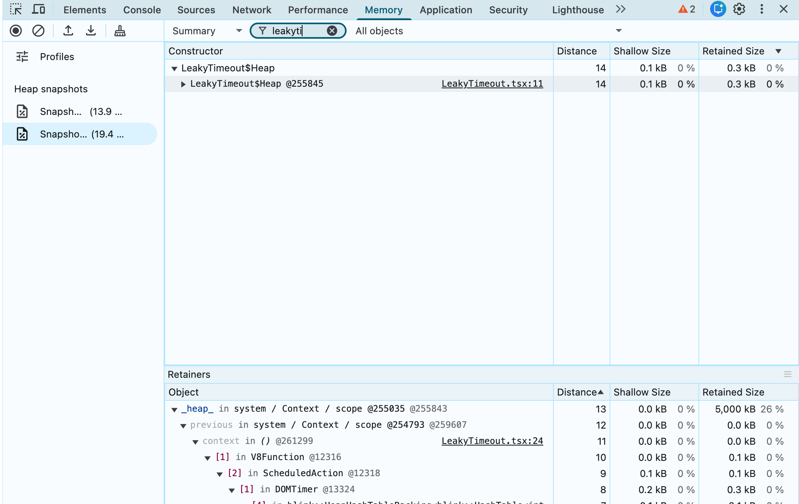

# react-memory-leak-detector

Catch React memory leaks the moment they happen — no heap snapshots required.

When a component unmounts but something still holds onto it (a stray timer,
listener, subscription, or closure), you get a **console warning** right away and
a **leak event** you can forward to your own logger or Sentry. Dev-only — it
compiles out of production builds.

## Install

```bash
npm install --save-dev react-memory-leak-detector
```

## Setup

Two steps: add the build plugin, then import the runtime once in dev.

### 1. Add the plugin

**Vite**

```ts
// vite.config.ts
import { defineConfig } from "vite";
import react from "@vitejs/plugin-react";
import heapMarkers from "react-memory-leak-detector/vite";

export default defineConfig({
  plugins: [
    heapMarkers(), // list it BEFORE react()
    react(),
  ],
});
```

Dev-only by default, so nothing ships to production. Works with any
`@vitejs/plugin-react` version (or none). Keep `heapMarkers()` before `react()` —
it warns you at startup if the order is wrong.

**Webpack / Next.js / Babel** — add the plugin to your Babel config, in development:

```json
// .babelrc
{ "env": { "development": { "plugins": ["react-memory-leak-detector/babel-plugin"] } } }
```

### 2. Import the runtime

Load it once at the top of your app entry, in dev only:

```js
// Vite
if (import.meta.env.DEV) import("react-memory-leak-detector/runtime");

// Webpack / Next.js
if (process.env.NODE_ENV === "development") import("react-memory-leak-detector/runtime");
```

That's it. Type declarations are bundled, so TypeScript needs no extra setup.

## Getting leaks

On page load the tracker installs, and leaks show up as console warnings as they
happen:

```
[heap-leak] Suspected leak: UserCard — 1 instance(s) unmounted >10s ago still retained (live 1 total)
```

Any time, run `window.__heapTracker.report()` for a live table of tracked
components. Two numbers matter:

- **live** — instances still in memory (mounted, or unmounted and not yet collected).
- **stale** — unmounted more than `leakAgeMs` ago and *still* in memory. **Stale is the leak.**

Prefer to handle leaks yourself — a debug overlay, your logger, Sentry? Subscribe:

```ts
const unsubscribe = window.__heapTracker.subscribe((event) => {
  // { component, stale, live, leakAgeMs, at }
  Sentry.captureMessage(`heap-leak:${event.component}`, { extra: event });
});
```

Events fire only for stale leaks and are debounced per component.
`configure({ logging: false })` keeps the events but silences the console.

## Finding the cause

A stale component tells you *what* leaked; a heap snapshot tells you *why*. In
Chrome DevTools → Memory, take a snapshot and filter for `ComponentName$Heap`:



Each row is a leaked instance. Select one and read the **Retainers** panel
bottom-up to see what's holding it — here a `DOMTimer`, i.e. an uncleared
`setTimeout`/`setInterval`. Clean it up on unmount and the instances disappear.

## Configuration

All options are optional. The common ones, passed to the plugin:

```ts
heapMarkers({
  leakAgeMs: 10000,   // ms unmounted-but-retained before it counts as a leak
  logging: true,      // console warnings on/off
  trackHooks: true,   // also track custom hooks, not just components
  excludeNames: [/^useTranslation$/], // component/hook names to skip entirely
});
```

Runtime options can also be changed live:
`window.__heapTracker.configure({ leakAgeMs: 5000 })`.

## Compatibility

| React feature                             | Status                                     |
| ----------------------------------------- | ------------------------------------------ |
| React 17 / 18 function components & hooks | ✅                                         |
| React 18 concurrent, Suspense, StrictMode | ✅                                         |
| SSR (effects no-op server-side)           | ✅                                         |
| React Compiler                            | ✅ likely; warrants a CI snapshot test     |
| `<Activity mode="hidden">`                | ⚠️ use `excludeUnmountTracking` to opt out |
| React Server Components                   | ⚠️ use `skipServerComponents: true`        |
| Class components                          | ❌ not instrumented (PRs welcome)          |

<details>
<summary>Advanced — all options, API, engines, and how it works</summary>

### All plugin options

```ts
heapMarkers({
  // ── build-time: what gets instrumented ──
  include: /\.[tj]sx?$/,              // files to process
  excludeNames: [/^useTranslation$/], // names that skip ALL instrumentation
  excludeUnmountTracking: [],         // names that keep the heap marker but skip
                                      //   the unmount effect — use for components
                                      //   under <Activity mode="hidden">, whose
                                      //   cleanup fires while still alive
  trackHooks: true,                   // false = components only
  skipServerComponents: false,        // true = skip files without "use client" (RSC)

  // ── runtime: how leaks are judged/reported (injected into the app) ──
  logging: true,                      // false = track silently, no console warnings
  leakAgeMs: 10000,                   // age before an unmounted instance is "stale"
  suspectThreshold: 1,                // min stale instances before warning/event
  sweepIntervalMs: 2000,              // how often the sweep runs
  warnCooldownMs: 30000,              // min gap between warnings for the same component
});
```

Runtime options can also be set before load (`window.__heapTrackerOptions = { … }`,
e.g. at the top of `main.tsx`) or live (`window.__heapTracker.configure({ … })`).

### `window.__heapTracker` API

| Call | Purpose |
| ---- | ------- |
| `report()` | `console.table` of every component with live instances; also returns the array. |
| `subscribe(fn)` | Listen for stale-leak events; returns an unsubscribe function. |
| `configure(opts)` | Update runtime options (e.g. `{ logging: false }`). |
| `sweep()` | Force an immediate sweep (otherwise every `sweepIntervalMs`). |
| `forceGc()` | `window.gc?.()` + re-sweep. Needs Chrome started with `--js-flags="--expose-gc"`; use it to rule out plain GC lag. |

Leak event shape: `{ component, stale, live, leakAgeMs, at }`. `component` matches
the `ComponentName$Heap` marker in heap snapshots.

### Engines (Vite plugin)

The Vite plugin injects markers with **Oxc** by default and falls back to
**Babel** automatically if `oxc-parser` can't load — you normally don't touch
this. Force one with `heapMarkers({ engine: "oxc" })` or `"babel"`. The Babel
engine parses with Babel and reads no project config, so non-default syntax
(decorators, `using`, import attributes) needs its parser opted in, e.g.
`heapMarkers({ engine: "babel", parserPlugins: ["decorators-legacy"] })`; the Oxc
engine parses these natively. `oxc-parser` needs Node ^20.19 or >=22.12.

TypeScript option types are exported as `HeapMarkersOptions`
(`/babel-plugin`) and `HeapMarkersViteOptions` (`/vite`).

### How it works

1. The plugin tags every component/hook with a uniquely-named marker —
   searchable as `ComponentName$Heap` in heap snapshots — and injects a synthetic
   `useEffect` that reports mount/unmount.
2. The runtime holds each marker in a `WeakRef` + `FinalizationRegistry` and
   sweeps periodically.
3. If a marker is still reachable well after its component unmounted, something
   is leaking it → warning + event.

</details>

## License

MIT
